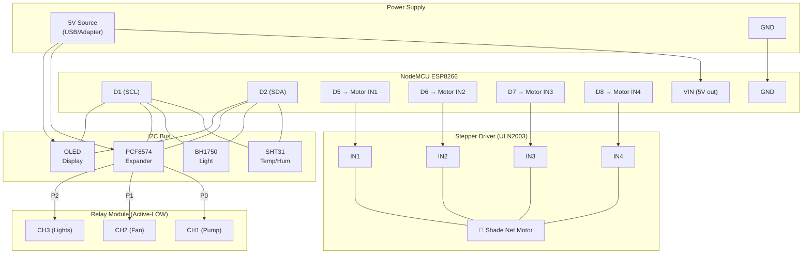

# PolyGuard — Relay Wiring & Updated Firmware

## Pin Mapping

| Actuator | Control Via | NodeMCU Pin | GPIO | Dashboard Key |
|---|---|---|---|---|
| 💧 Water Pump | **PCF8574 P0** | I2C D1/D2 | 5 / 4 | `waterPump` |
| 💨 Ventilation Fan | **PCF8574 P1** | I2C D1/D2 | 5 / 4 | `fan` |
| 💡 Grow Lights | **PCF8574 P2** | I2C D1/D2 | 5 / 4 | `growLights` |
| 🌿 Shade Net | **Native Stepper** | **D5, D6, D7, D8** | 14, 12, 13, 15 | `shadeNet` |

---

## I2C Bus Configuration (D1=SCL, D2=SDA)

| Device | I2C Address | Function |
|---|---|---|
| **SHT31** | 0x44 / 0x45 | Temp & Humidity Sensor |
| **BH1750** | 0x23 | Light Intensity Sensor |
| **PCF8574** | 0x20 | I/O Expander for Relays |
| **OLED (SSD1306)** | 0x3C | Local Status Display |

> [!IMPORTANT]
> - Relays (CH1-CH3) are **active-LOW**.
> - Shade Net now uses a **Stepper Motor** (e.g., 28BYJ-48 with ULN2003 driver).

---

## Circuit Diagram



---

## Wiring Steps

1. **Power the Relay Module**
   - `VCC` → NodeMCU `VIN` (5V when powered via USB)
   - `GND` → NodeMCU `GND`

2. **Signal Wires** (NodeMCU → Relay IN pins)
   - `D5` → `IN1` (Water Pump)
   - `D6` → `IN2` (Ventilation Fan)
   - `D7` → `IN3` → Grow Lights)
   - `D8` → `IN4` (Shade Net)

3. **Load Wiring** (for each actuator on each relay channel):
   - Connect `COM` to the **live/positive** wire of your power supply
   - Connect `NO` (Normally Open) to the **+** terminal of the actuator
   - Connect the actuator's **−** terminal back to the power supply negative

> [!WARNING]
> If your actuators run on **mains AC (220V)**, use proper insulated wires and enclosures. Make sure the relay module is rated for your load current.

---

## Updated Firmware

```cpp
#include <Wire.h>
#include <Adafruit_SHT31.h>
#include <BH1750.h>
#include <PCF8574.h>
#include <Adafruit_GFX.h>
#include <Adafruit_SSD1306.h>
#include <Stepper.h>

// ── WiFi Credentials ─────────────────────────────────────────
const char* ssid     = "POCO F5";
const char* password = "12345678";

// ── I2C Expansion ─────────────────────────────────────────────
PCF8574 pcf(0x20); // GPIO P0=Pump, P1=Fan, P2=Lights
#define SCREEN_WIDTH 128
#define SCREEN_HEIGHT 64
Adafruit_SSD1306 display(SCREEN_WIDTH, SCREEN_HEIGHT, &Wire, -1);

// ── Native Stepper (Shade Net) ────────────────────────────────
const int STEPS_PER_REV = 2048; 
Stepper shadeStepper(STEPS_PER_REV, D5, D7, D6, D8); 
// Note: D5, D6, D7, D8 sequence (GPIO 14, 12, 13, 15)

// ── Sensors ───────────────────────────────────────────────────
ESP8266WebServer server(80);
Adafruit_SHT31 sht30 = Adafruit_SHT31();
BH1750 lightMeter;
const int SOIL_PIN = A0;

// ── Global Sensor Values ──────────────────────────────────────
float temp = 0, hum = 0, lux = 0;
int soilPercent = 0;
unsigned long lastPrintTime = 0;

// ── Actuator State (false = OFF, true = ON) ───────────────────
bool pumpOn   = false;
bool fanOn    = false;
bool lightsOn = false;
bool shadeOn  = false;

// ── Helpers ───────────────────────────────────────────────────
void addCORSHeaders() {
  server.sendHeader("Access-Control-Allow-Origin",  "*");
  server.sendHeader("Access-Control-Allow-Methods", "GET, POST, OPTIONS");
  server.sendHeader("Access-Control-Allow-Headers", "Content-Type");
}

// PCF8574 is active-LOW for relays: true→ON = LOW, false→OFF = HIGH
void applyRelay(uint8_t pin, bool state) {
  pcf.write(pin, state ? LOW : HIGH);
}

void updateOLED() {
  display.clearDisplay();
  display.setTextSize(1);
  display.setTextColor(WHITE);
  display.setCursor(0,0);
  display.println("POLYGUARD STATUS");
  display.drawLine(0, 10, 128, 10, WHITE);
  
  display.setCursor(0, 15);
  display.print("Temp: "); display.print(temp, 1); display.println(" C");
  display.print("Hum : "); display.print(hum, 1);  display.println(" %");
  display.print("Lux : "); display.print(lux, 0);  display.println(" lx");
  
  display.setCursor(0, 45);
  display.print("Pump: "); display.println(pumpOn ? "ON" : "OFF");
  display.print("Net : "); display.println(shadeOn ? "OPEN" : "CLOSED");
  
  display.display();
}

void rotateShadeNet(bool open) {
  static bool isCurrentlyOpen = false;
  if (open == isCurrentlyOpen) return; 

  Serial.println(open ? "Opening Shade Net (10 turns)..." : "Closing Shade Net (10 turns)...");
  
  int steps = 10 * STEPS_PER_REV;
  shadeStepper.setSpeed(10); 
  shadeStepper.step(open ? steps : -steps);
  
  isCurrentlyOpen = open;
  // De-energize coils
  digitalWrite(D5, LOW); digitalWrite(D6, LOW); digitalWrite(D7, LOW); digitalWrite(D8, LOW);
  updateOLED();
}

void readSensors() {
  temp = sht30.readTemperature();
  hum  = sht30.readHumidity();
  if (isnan(temp) || isnan(hum)) { temp = 0; hum = 0; }

  lux = lightMeter.readLightLevel();
  if (lux < 0) lux = 0;

  int rawSoil  = analogRead(SOIL_PIN);
  soilPercent  = map(rawSoil, 800, 300, 0, 100);
  soilPercent  = constrain(soilPercent, 0, 100);
}

// ── GET / ─────────────────────────────────────────────────────
void handleRoot() {
  addCORSHeaders();
  readSensors();
  String json = "{";
  json += "\"ip\":\""           + WiFi.localIP().toString() + "\",";
  json += "\"temperature\":"    + String(temp, 1)           + ",";
  json += "\"humidity\":"       + String(hum, 1)            + ",";
  json += "\"light_lux\":"      + String(lux, 1)            + ",";
  json += "\"soil_moisture\":"  + String(soilPercent)       + ",";
  json += "\"soilPH\":0,\"co2\":0,\"nitrogen\":0,\"phosphorus\":0,\"potassium\":0";
  json += "}";
  server.send(200, "application/json", json);
}

// ── GET /state ────────────────────────────────────────────────
void handleState() {
  addCORSHeaders();
  String json = "{";
  json += "\"waterPump\":"          + String(pumpOn   ? "true" : "false") + ",";
  json += "\"fan\":"                + String(fanOn    ? "true" : "false") + ",";
  json += "\"growLights\":"         + String(lightsOn ? "true" : "false") + ",";
  json += "\"shadeNet\":"           + String(shadeOn  ? "true" : "false") + ",";
  json += "\"automationEnabled\":false";
  json += "}";
  server.send(200, "application/json", json);
}

// ── POST /control ─────────────────────────────────────────────
// Body: {"waterPump":true} or {"fan":false} etc.
void handleControl() {
  addCORSHeaders();
  if (!server.hasArg("plain")) { server.send(400, "application/json", "{\"error\":\"No body\"}"); return; }

  String body = server.arg("plain");
  Serial.println("Control received: " + body);

  // Simple key-value parse (no external JSON lib needed)
  auto extractBool = [&](const String& key) -> int {
    int idx = body.indexOf("\"" + key + "\"");
    if (idx == -1) return -1;
    int colon = body.indexOf(":", idx);
    if (colon == -1) return -1;
    return body.indexOf("true", colon) < body.indexOf(",", colon) ||
           (body.indexOf(",", colon) == -1 && body.indexOf("true", colon) != -1) ? 1 : 0;
  };

  int v;
  if ((v = extractBool("waterPump"))  != -1) { pumpOn   = v; applyRelay(0, pumpOn);    }
  if ((v = extractBool("fan"))        != -1) { fanOn    = v; applyRelay(1, fanOn);    }
  if ((v = extractBool("growLights")) != -1) { lightsOn = v; applyRelay(2, lightsOn); }
  if ((v = extractBool("shadeNet"))   != -1) { shadeOn  = v; rotateShadeNet(shadeOn);  }

  handleState(); // respond with current state
}

// ── OPTIONS (CORS pre-flight) ─────────────────────────────────
void handleOptions() {
  addCORSHeaders();
  server.send(204);
}

// ── SETUP ─────────────────────────────────────────────────────
void setup() {
  Serial.begin(115200);

  // Stepper pins
  pinMode(D5, OUTPUT); pinMode(D6, OUTPUT); pinMode(D7, OUTPUT); pinMode(D8, OUTPUT);
  digitalWrite(D5, LOW); digitalWrite(D6, LOW); digitalWrite(D7, LOW); digitalWrite(D8, LOW);

  // I2C 
  Wire.begin(D2, D1); // D2=SDA, D1=SCL
  
  // Expander
  pcf.begin();
  pcf.write(0, HIGH); pcf.write(1, HIGH); pcf.write(2, HIGH); // Initial OFF (active-LOW)
  
  // OLED
  if(!display.begin(SSD1306_SWITCHCAPVCC, 0x3C)) Serial.println("OLED init failed");
  display.clearDisplay();
  display.display();

  // Sensors
  Wire.begin(D2, D1);
  if (!sht30.begin(0x45)) {
    Serial.println("SHT30 not at 0x45, trying 0x44...");
    if (!sht30.begin(0x44)) Serial.println("SHT30 wiring error!");
  }
  if (!lightMeter.begin(BH1750::CONTINUOUS_HIGH_RES_MODE))
    Serial.println("BH1750 wiring error!");
  
  updateOLED(); // Initial display

  // WiFi
  WiFi.begin(ssid, password);
  Serial.print("Connecting");
  while (WiFi.status() != WL_CONNECTED) { delay(500); Serial.print("."); }
  Serial.println("\n--- POLYGUARD READY ---");
  Serial.print("IP: "); Serial.println(WiFi.localIP());
  Serial.println("-----------------------");

  // Routes
  server.on("/",        HTTP_GET,     handleRoot);
  server.on("/state",   HTTP_GET,     handleState);
  server.on("/control", HTTP_POST,    handleControl);
  server.on("/",        HTTP_OPTIONS, handleOptions);
  server.on("/state",   HTTP_OPTIONS, handleOptions);
  server.on("/control", HTTP_OPTIONS, handleOptions);
  server.begin();
}

// ── LOOP ──────────────────────────────────────────────────────
void loop() {
  server.handleClient();

  if (millis() - lastPrintTime >= 2000) {
    readSensors();
    updateOLED(); // Refresh display
    Serial.println("\n>>> SENSOR UPDATE <<<");
    Serial.print("IP     : "); Serial.println(WiFi.localIP());
    Serial.print("TEMP   : "); Serial.print(temp);        Serial.println(" C");
    Serial.print("HUM    : "); Serial.print(hum);         Serial.println(" %");
    Serial.print("LIGHT  : "); Serial.print(lux);         Serial.println(" lx");
    Serial.print("SOIL   : "); Serial.print(soilPercent); Serial.println(" %");
    Serial.print("PUMP   : "); Serial.println(pumpOn   ? "ON" : "OFF");
    Serial.print("FAN    : "); Serial.println(fanOn    ? "ON" : "OFF");
    Serial.print("LIGHTS : "); Serial.println(lightsOn ? "ON" : "OFF");
    Serial.print("SHADE  : "); Serial.println(shadeOn  ? "ON" : "OFF");
    Serial.println("---------------------");
    lastPrintTime = millis();
  }
}
```
